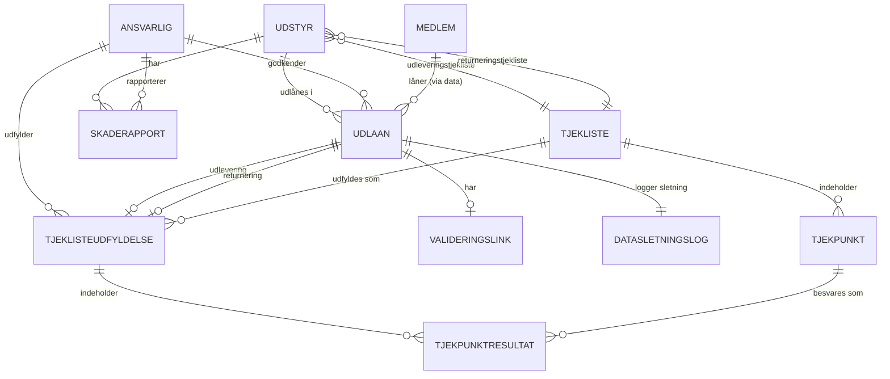

# Datamodel - Orangemakers Udlånssystem

Database design og datastruktur med privacy-by-design fokus.

**Se også:**
- [Funktionelle Krav](FUNKTIONELLE-KRAV.md) for krav til entiteter
- [Process Flows](FLOWS.md) for hvordan data bruges
- [User Stories](USER-STORIES.md) for baggrund

---

## Entity Relationship Diagram



---

## Entiteter

### Udstyr

Fysiske genstande der kan udlånes.

**Felter:**
```
ID: UUID (primary key)
RFID_tag: String (unique, RFID klistermærke til scanning)
Navn: String
Type: Enum (skruemaskine, rundsav, værktøj, diverse)
Beskrivelse: Text
Status: Enum (ledig, udlånt, beskadiget, til-reparation)
Placering: String (hvor opbevares den?)
Generel_note: Text (NULL hvis ingen, fx "Maskinen er kendt for at rasle" eller "Kan lugte hvis man presser den hårdt")
Standard_laaneperiode_dage: Integer (default forslag, fx 2 dage)
Maks_laaneperiode_dage: Integer (absolut maksimum, fx 7 dage)
Oprettet_dato: DateTime
Udleveringstjekliste_id: UUID (foreign key → Tjekliste)
Returneringstjekliste_id: UUID (foreign key → Tjekliste)
```

**Relaterede krav:** FR-006, FR-007, FR-008, FR-009, FR-010
**Bruges i flows:** [Flow 2](FLOWS.md#flow-2-udlån-til-medlem), [Flow 3](FLOWS.md#flow-3-udlån-til-ikke-medlem-placering), [Flow 4](FLOWS.md#flow-4-returnering-af-udstyr)

---

### Udlån

**KRITISK ENTITET - Privacy-by-Design Implementation**

Registrerer udlån af udstyr. Indeholder midlertidige persondata der slettes ved returnering.

**Felter:**
```
ID: UUID (primary key)
Udstyr_id: UUID (foreign key → Udstyr)
Status: Enum (aktiv, returneret)
Udlånsdato: DateTime
Forventet_returdato: DateTime
Faktisk_returdato: DateTime (NULL hvis ikke returneret)
Ansvarlig_id: UUID (foreign key → Ansvarlig)
Udleveringstjekliste_udfyldelse_id: UUID (foreign key → TjeklisteUdfyldelse)
Returneringstjekliste_udfyldelse_id: UUID (foreign key → TjeklisteUdfyldelse, NULL hvis ikke returneret)

--- PERSONDATA (NULL'ES EFTER 3 MÅNEDER) ---
Laantager_navn: String (NULL 3 måneder efter returnering)
Laantager_kontakt: String (NULL 3 måneder efter returnering)
Laantager_type: Enum (medlem, placering) (NULL 3 måneder efter returnering)
Medlemsnummer: String (NULL 3 måneder efter returnering, hvis medlem)
Placering_adresse: String (NULL 3 måneder efter returnering, hvis ikke-medlem)
Validerings_token: String (NULL 3 måneder efter returnering, hvis brugt)
Validerings_status: Enum (afventer, bekræftet) (NULL 3 måneder efter returnering)
Planlagt_sletning_dato: DateTime (sættes til returnering + 3 måneder)

--- BEKRÆFTELSER OG ANSVARSFRASKRIVELSE ---
Laantager_bekraeftelse_instruktion: Boolean (låntager bekræfter modtaget instruktion)
Laantager_bekraeftelse_kompetence: Boolean (låntager bekræfter at kunne bruge udstyret)
Laantager_bekraeftelse_dato: DateTime
Ansvarlig_bekraeftelse_instruktion: Boolean (ansvarlig bekræfter givet instruktion)
Ansvarlig_bekraeftelse_dato: DateTime

--- ANONYMISERET DATA (BEVARES) ---
Laantager_type_anon: Enum (medlem, placering)
Varighed_dage: Integer (beregnes ved returnering)
Udlaans_maaned: Integer (1-12)
Udlaans_aar: Integer (YYYY)
```

**Privacy Note:** Persondata bevares i 3 måneder efter returnering for support/tvister. Efter 3 måneder NULL'es felterne automatisk (FR-013, FR-017). Anonymiseret data bevares permanent for statistik (FR-019).

**Ansvarsfraskrivelse Note:** Både låntager og ansvarlig skal bekræfte instruktion er givet/modtaget. Dette dokumenterer at foreningen har opfyldt sin undervisningspligt og låntager har bekræftet kompetence, hvilket fraskriver foreningen ansvar ved skader på person eller udstyr.

**Relaterede krav:** FR-011, FR-012, FR-013, FR-014, FR-015, FR-016, FR-017, FR-044, FR-045, FR-046, NFR-002
**Bruges i flows:** Alle flows
**Relaterede user stories:** US-002, US-003, US-013

---

### Ansvarlig

Brugere der administrerer udlån.

**Felter:**
```
ID: UUID (primary key)
Navn: String
Email: String (unique)
Rolle: Enum (ansvarlig, administrator)
Aktiv: Boolean
RFID_kode: String (unique, NULL hvis ikke bruger RFID)
Password_hash: String (NULL hvis kun RFID)
Oprettet_dato: DateTime
```

**Relaterede krav:** FR-020, FR-021
**Bruges i flows:** [Flow 1](FLOWS.md#flow-1-ansvarlig-logger-ind)
**Relaterede user stories:** US-005

---

### Medlem

Medlemmer af Orangemakers der kan låne udstyr.

**Felter:**
```
ID: UUID (primary key)
Navn: String
RFID_kode: String (unique)
Medlemsnummer: String (unique)
Status: Enum (aktiv, inaktiv)
Gyldigt_fra_dato: Date
Gyldigt_til_dato: Date
Oprettet_dato: DateTime
```

**Relaterede krav:** FR-022, FR-023
**Bruges i flows:** [Flow 2](FLOWS.md#flow-2-udlån-til-medlem)
**Relaterede user stories:** US-006

---

### Tjekliste

Skabelon for tjeklister (udlevering eller returnering).

**Felter:**
```
ID: UUID (primary key)
Navn: String
Type: Enum (udlevering, returnering)
Udstyrstype: String (kategori)
Beskrivelse: Text
Oprettet_dato: DateTime
```

**Relaterede krav:** FR-030, FR-031, FR-032, FR-036
**Bruges i flows:** [Flow 2](FLOWS.md#flow-2-udlån-til-medlem), [Flow 3](FLOWS.md#flow-3-udlån-til-ikke-medlem-placering), [Flow 4](FLOWS.md#flow-4-returnering-af-udstyr)
**Relaterede user stories:** US-012

---

### Tjekpunkt

Individuelle punkter i en tjekliste.

**Felter:**
```
ID: UUID (primary key)
Tjekliste_id: UUID (foreign key → Tjekliste)
Beskrivelse: String
Raekkefoelge: Integer (for sortering)
Obligatorisk: Boolean
Type: Enum (afkrydsning, note)
```

**Relaterede krav:** FR-035
**Relaterede user stories:** US-009, US-010

---

### TjeklisteUdfyldelse

Konkret udfyldelse af en tjekliste for et specifikt udlån.

**Felter:**
```
ID: UUID (primary key)
Udlaan_id: UUID (foreign key → Udlån)
Tjekliste_id: UUID (foreign key → Tjekliste)
Udfyldt_af: UUID (foreign key → Ansvarlig)
Udfyldt_dato: DateTime
Type: Enum (udlevering, returnering)
```

**Relaterede krav:** FR-033, FR-034
**Relaterede user stories:** US-009, US-010

---

### TjekpunktResultat

Svar på individuelt tjekpunkt i en udfyldt tjekliste.

**Felter:**
```
ID: UUID (primary key)
Tjeklisteudfyldelse_id: UUID (foreign key → TjeklisteUdfyldelse)
Tjekpunkt_id: UUID (foreign key → Tjekpunkt)
Status: Enum (OK, Ikke-OK, N/A)
Note: Text (NULL hvis ingen)
```

**Relaterede krav:** FR-035
**Relaterede user stories:** US-009, US-010

---

### Skaderapport

Rapporter om skader på udstyr.

**Felter:**
```
ID: UUID (primary key)
Udstyr_id: UUID (foreign key → Udstyr)
Udlaan_id: UUID (foreign key → Udlån, NULL hvis ikke relateret til udlån)
Rapporteret_af: UUID (foreign key → Ansvarlig)
Rapporteret_dato: DateTime
Beskrivelse: Text
Status: Enum (afventer-reparation, under-reparation, repareret)
Repareret_dato: DateTime (NULL hvis ikke repareret)
Reparations_noter: Text (NULL hvis ingen)
```

**Relaterede krav:** FR-037, FR-038, FR-039, FR-040, FR-041
**Bruges i flows:** [Flow 4](FLOWS.md#flow-4-returnering-af-udstyr), [Flow 5](FLOWS.md#flow-5-reparation-af-beskadiget-udstyr)
**Relaterede user stories:** US-011

---

### ValideringsLink

Oprettelseslinks sendt til ikke-medlemmer så de selv kan udfylde deres oplysninger.

**Felter:**
```
ID: UUID (primary key)
Token: String (unique, random generated)
Laantager_email_telefon: String (kontaktinfo link sendes til)
Oprettet_dato: DateTime
Udloeber_dato: DateTime (fx 24 timer fra oprettelse)
Status: Enum (afventer, udfyldt, godkendt, afvist)
Udfyldt_dato: DateTime (NULL hvis ikke udfyldt)
Godkendt_dato: DateTime (NULL hvis ikke godkendt)
Godkendt_af: UUID (foreign key → Ansvarlig, NULL hvis ikke godkendt)
Udlaan_id: UUID (foreign key → Udlån, foreløbigt udlån)
```

**Note:** Når låntager har udfyldt via link sættes status til "udfyldt". Ansvarlig gennemser på skærm og sætter status til "godkendt" eller "afvist".

**Relaterede krav:** FR-026, FR-027, FR-028, FR-029, FR-030, FR-031, FR-055, FR-056
**Bruges i flows:** [Flow 3](FLOWS.md#flow-3-udlån-til-ikke-medlem-placering), [Flow 6](FLOWS.md#flow-6-låntagers-udfyldelse-emailsms-link)
**Relaterede user stories:** US-008

---

### DataSletningsLog

Audit log for datasletning (GDPR compliance).

**Felter:**
```
ID: UUID (primary key)
Udlaan_id: UUID (foreign key → Udlån)
Slettet_dato: DateTime
Aarsag: String (typisk "returnering")
Slettet_af: Enum (system, bruger)
```

**Relaterede krav:** FR-018, NFR-003
**Bruges i flows:** [Flow 4](FLOWS.md#flow-4-returnering-af-udstyr)
**Relaterede user stories:** US-002

---

## Privacy-by-Design Princip

**Vigtigt**: Persondata om låntager opbevares IKKE som separat entitet, men som midlertidige felter på Udlån-entiteten. Persondata bevares i 3 måneder efter returnering for support/tvister, derefter NULL'es felterne automatisk.

### Datasletning ved Returnering

**Trin (ved returnering):**
1. System sætter `Faktisk_returdato` på Udlån
2. System beregner `Varighed_dage` = (Faktisk_returdato - Udlånsdato)
3. System sætter `Planlagt_sletning_dato` = Faktisk_returdato + 3 måneder
4. System bevarer persondata felter midlertidigt (i 3 måneder)
5. System kopierer til anonymiseret data:
   - `Laantager_type` → `Laantager_type_anon`
   - Beregnet `Varighed_dage`
   - `Udlaans_maaned`
   - `Udlaans_aar`
6. System opdaterer Udstyr status

**Trin (3 måneder efter returnering - automatisk job):**
1. System finder alle Udlån hvor `Planlagt_sletning_dato` <= nu
2. For hver Udlån, NULL persondata felter:
   - `Laantager_navn` → NULL
   - `Laantager_kontakt` → NULL
   - `Laantager_type` → NULL
   - `Medlemsnummer` → NULL
   - `Placering_adresse` → NULL
   - `Validerings_token` → NULL
   - `Validerings_status` → NULL
3. System opretter entry i DataSletningsLog (årsag: "3-måneders-retention")
4. Anonymiseret data bevares permanent

**Se også:** [Privacy Dataflow Diagram](FLOWS.md#dataflow-privacy-by-design-ved-returnering)

---

## Tjekliste Struktur

Tjeklister knyttes til udstyr ved oprettelse:
- Udstyr har reference til `Udleveringstjekliste`
- Udstyr har reference til `Returneringstjekliste`

Ved udlån/returnering:
1. System finder relevant Tjekliste via Udstyr
2. System opretter TjeklisteUdfyldelse
3. For hvert Tjekpunkt oprettes TjekpunktResultat
4. Ansvarlig udfylder hver TjekpunktResultat

---

## Indexes (Anbefaling)

For optimal performance:

```sql
-- Udstyr
CREATE UNIQUE INDEX idx_udstyr_rfid ON Udstyr(RFID_tag);
CREATE INDEX idx_udstyr_status ON Udstyr(Status);
CREATE INDEX idx_udstyr_type ON Udstyr(Type);

-- Udlån
CREATE INDEX idx_udlaan_status ON Udlaan(Status);
CREATE INDEX idx_udlaan_udstyr ON Udlaan(Udstyr_id);
CREATE INDEX idx_udlaan_ansvarlig ON Udlaan(Ansvarlig_id);
CREATE INDEX idx_udlaan_datoer ON Udlaan(Udlånsdato, Forventet_returdato);

-- Ansvarlig
CREATE UNIQUE INDEX idx_ansvarlig_email ON Ansvarlig(Email);
CREATE UNIQUE INDEX idx_ansvarlig_rfid ON Ansvarlig(RFID_kode) WHERE RFID_kode IS NOT NULL;

-- Medlem
CREATE UNIQUE INDEX idx_medlem_rfid ON Medlem(RFID_kode);
CREATE UNIQUE INDEX idx_medlem_nummer ON Medlem(Medlemsnummer);
CREATE INDEX idx_medlem_status ON Medlem(Status);

-- ValideringsLink
CREATE UNIQUE INDEX idx_validering_token ON ValideringsLink(Token);
CREATE INDEX idx_validering_udloeb ON ValideringsLink(Udloeber_dato) WHERE Brugt = FALSE;
```

---

## Data Retention Policy

| Entitet | Persondata | Retention |
|---------|-----------|-----------|
| Udlån | Ja (midlertidigt) | **3 måneder efter returnering** |
| Medlem | Ja | Så længe medlemskab er aktivt |
| Ansvarlig | Ja | Så længe ansættelse/rolle er aktiv |
| ValideringsLink | Ja | 30 dage efter udløb |
| DataSletningsLog | Nej (kun audit) | 5 år (GDPR krav) |
| Alle andre | Nej | Permanent (statistik/historik) |

**Rationale for 3 måneders retention:**
- Tillader håndtering af tvister eller reklamationer
- Giver tid til opfølgning på skader
- Balancerer GDPR's dataminimeringsprincip med praktiske behov

---

**Version**: 0.1
**Dato**: 2025-10-06
**Se også**: [KRAVSPECIFIKATION.md](KRAVSPECIFIKATION.md) | [FUNKTIONELLE-KRAV.md](FUNKTIONELLE-KRAV.md) | [FLOWS.md](FLOWS.md)
