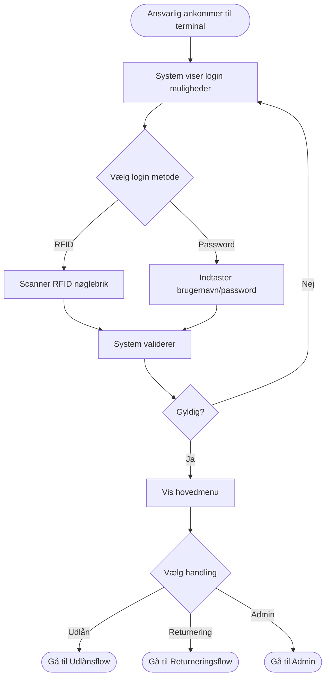
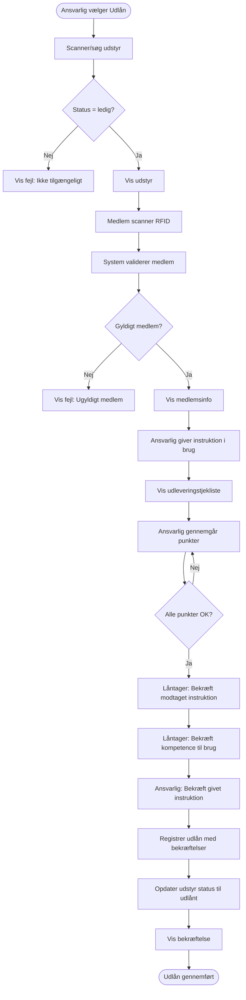
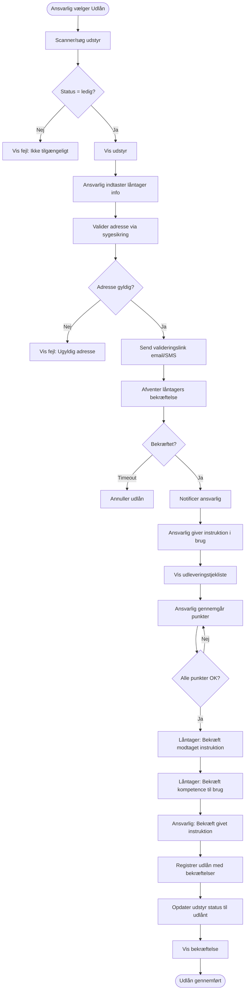
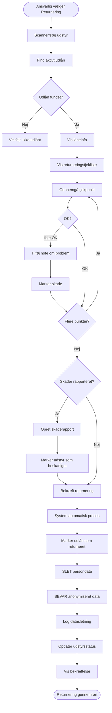
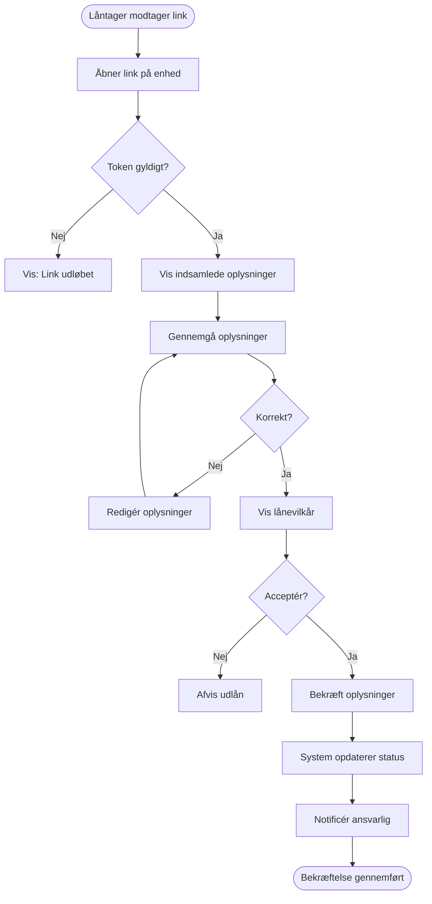
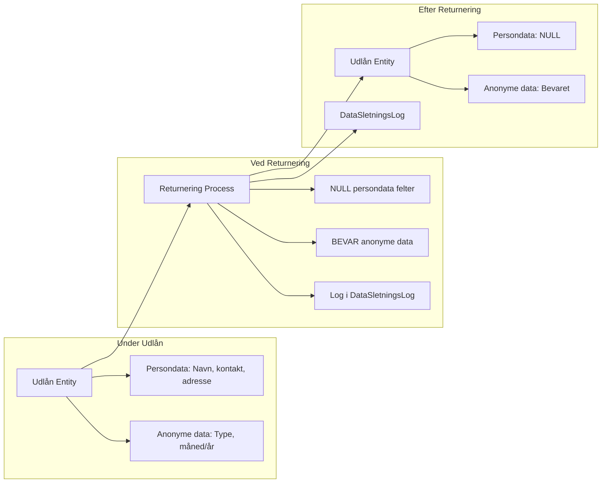

# Process Flows - Orangemakers Udlånssystem

Dette dokument beskriver de primære process flows i systemet med Mermaid diagrammer.

**Se også:**
- [User Stories](USER-STORIES.md) for baggrund
- [Funktionelle Krav](FUNKTIONELLE-KRAV.md) for tekniske krav

---

## Flow 1: Ansvarlig Logger Ind

**Relaterede krav:** FR-020, FR-021, FR-022, US-005

---

## Flow 2: Udlån til Medlem

**Relaterede krav:** FR-011, FR-022, FR-023, FR-030, FR-033, FR-044, FR-045, FR-046, FR-047, FR-048, US-006, US-009, US-013

**Ansvarsfraskrivelse:** Dette flow inkluderer juridisk vigtige bekræftelser der dokumenterer instruktion er givet og modtaget, hvilket fraskriver foreningen ansvar.

---

## Flow 3: Udlån til Ikke-medlem (Placering)

**Relaterede krav:** FR-011, FR-024, FR-025, FR-026, FR-027, FR-028, FR-030, FR-033, FR-044, FR-045, FR-046, FR-047, FR-048, US-007, US-008, US-009, US-013

**Ansvarsfraskrivelse:** Dette flow inkluderer juridisk vigtige bekræftelser der dokumenterer instruktion er givet og modtaget, hvilket fraskriver foreningen ansvar.

---

## Flow 4: Returnering af Udstyr

**Relaterede krav:** FR-012, FR-013, FR-017, FR-018, FR-031, FR-034, FR-037, FR-038, US-010, US-011

**Privacy Note:** Dette flow demonstrerer automatisk datasletning (NFR-002, FR-017)

---

## Flow 5: Reparation af Beskadiget Udstyr

**Relaterede krav:** FR-040, FR-041, US-011

---

## Flow 6: Låntagers Bekræftelse (Email/SMS Link)

**Relaterede krav:** FR-028, FR-029, US-008

---

## Dataflow: Privacy-by-Design ved Returnering

**Relaterede krav:** NFR-002, FR-017, FR-018, US-002

---

**Version**: 0.1
**Dato**: 2025-10-06
**Se også**: [KRAVSPECIFIKATION.md](KRAVSPECIFIKATION.md) | [USER-STORIES.md](USER-STORIES.md) | [DATAMODEL.md](DATAMODEL.md)
