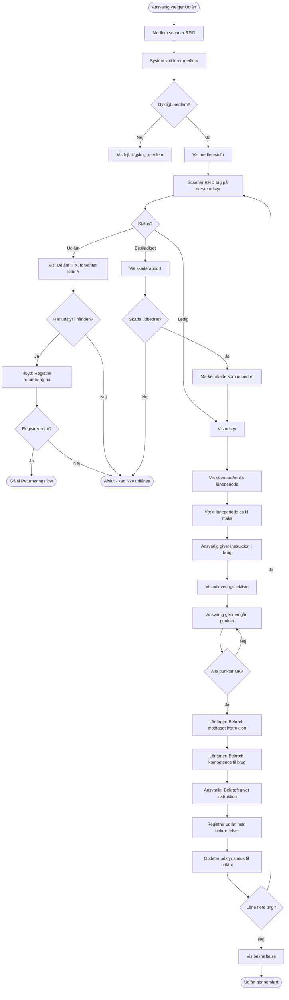
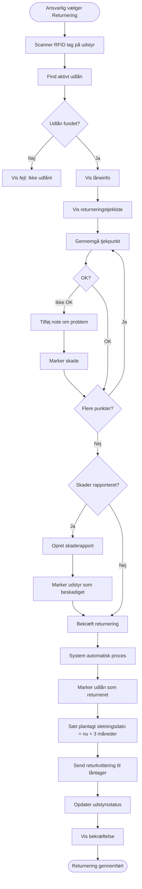
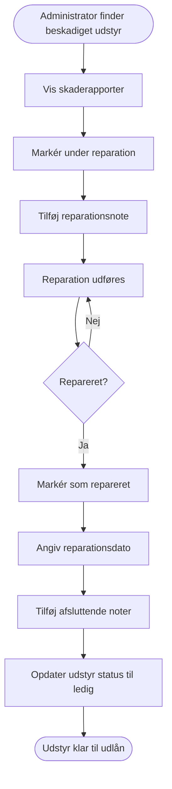
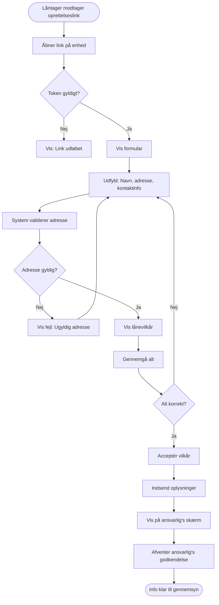
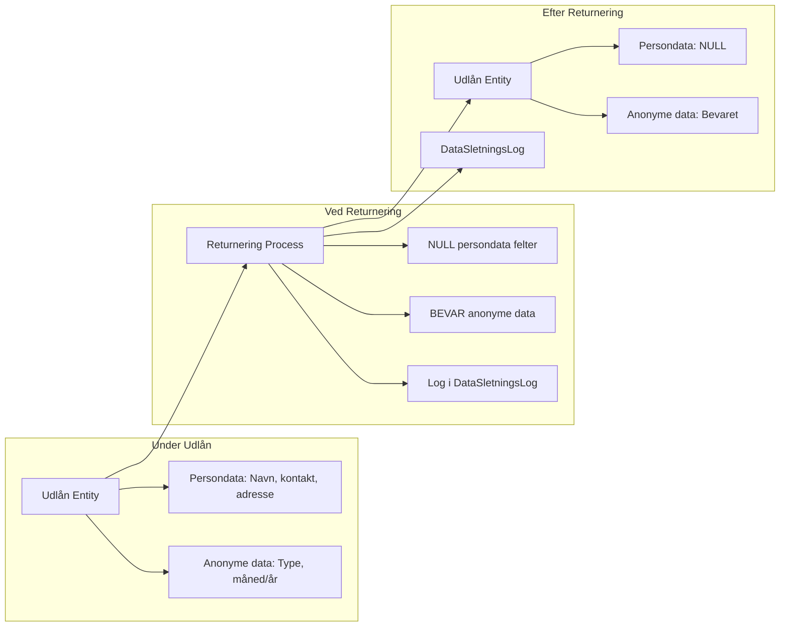

# Process Flows - Orangemakers Udlånssystem

Dette dokument beskriver de primære process flows i systemet med Mermaid diagrammer.

**Se også:**
- [User Stories](USER-STORIES.md) for baggrund
- [Funktionelle Krav](FUNKTIONELLE-KRAV.md) for tekniske krav

---

## Flow 1: Ansvarlig Logger Ind

**Relaterede krav:** FR-020, FR-021, FR-022, US-005

---

## Flow 2: Udlån til Medlem

**Relaterede krav:** FR-010, FR-011, FR-022, FR-023, FR-032, FR-035, FR-044, FR-045, FR-046, FR-047, FR-048, FR-052, FR-053, FR-054, US-006, US-009, US-013

**Ansvarsfraskrivelse:** Dette flow inkluderer juridisk vigtige bekræftelser der dokumenterer instruktion er givet og modtaget, hvilket fraskriver foreningen ansvar.

---

## Flow 3: Udlån til Ikke-medlem (Placering)

```mermaid
flowchart TD
    Start([Ansvarlig vælger Udlån]) --> AskContact[Spørg låntager om telefon eller email]
    AskContact --> EnterContact[Indtast telefon/email]
    EnterContact --> CheckKnown{Kendt i systemet?}
    CheckKnown -->|Ja| SendNewLink[Send nyt oprettelseslink]
    CheckKnown -->|Nej| SendLink[Send oprettelseslink email/SMS]
    SendNewLink --> WaitInfo[Afventer låntager udfylder]
    SendLink --> WaitInfo
    WaitInfo --> BorrowerFills([Låntager: Udfylder info via link])
    BorrowerFills --> ValidateAddress[System: Valider adresse via sygesikring]
    ValidateAddress --> AddressValid{Adresse gyldig?}
    AddressValid -->|Nej| ShowError[Vis fejl til låntager]
    AddressValid -->|Ja| BorrowerSubmit[Låntager: Indsend oplysninger]
    BorrowerSubmit --> NotifyScreen[Vis på skærm til ansvarlig]
    NotifyScreen --> ReviewInfo[Ansvarlig: Gennemse oplysninger]
    ReviewInfo --> ApproveInfo{Godkend info?}
    ApproveInfo -->|Nej| RejectInfo[Afvis - bed om korrektioner]
    RejectInfo --> WaitInfo
    ApproveInfo -->|Ja| ShowBorrower[Vis godkendte låntager info]
    ShowBorrower --> ScanEquip[Scanner RFID tag på udstyr]
    ScanEquip --> CheckStatus{Status?}
    CheckStatus -->|Ledig| ShowEquip[Vis udstyr]
    CheckStatus -->|Udlånt| ShowLoanInfo[Vis: Udlånt til X, forventet retur Y]
    CheckStatus -->|Beskadiget| ShowDamage[Vis skaderapport]
    ShowLoanInfo --> HasEquip{Har udstyr i hånden?}
    HasEquip -->|Ja| OfferReturn[Tilbyd: Registrer returnering nu]
    OfferReturn --> AcceptReturn{Registrer retur?}
    AcceptReturn -->|Ja| ReturnFlow([Gå til Returneringsflow])
    AcceptReturn -->|Nej| End1([Afslut - kan ikke udlånes])
    HasEquip -->|Nej| End1
    ShowDamage --> CheckRepair{Skade udbedret?}
    CheckRepair -->|Nej| End1
    CheckRepair -->|Ja| MarkRepaired[Marker skade som udbedret]
    MarkRepaired --> ShowEquip
    ShowEquip --> ShowPeriod[Vis standard/maks låneperiode]
    ShowPeriod --> SelectPeriod[Vælg låneperiode op til maks]
    SelectPeriod --> GiveInstr[Ansvarlig giver instruktion i brug]
    GiveInstr --> Checklist[Vis udleveringstjekliste]
    Checklist --> CheckItems[Ansvarlig gennemgår punkter]
    CheckItems --> AllDone{Alle punkter OK?}
    AllDone -->|Nej| CheckItems
    AllDone -->|Ja| Confirm1[Låntager: Bekræft modtaget instruktion]
    Confirm1 --> Confirm2[Låntager: Bekræft kompetence til brug]
    Confirm2 --> Confirm3[Ansvarlig: Bekræft givet instruktion]
    Confirm3 --> RegisterLoan[Registrer udlån med bekræftelser]
    RegisterLoan --> UpdateStatus[Opdater udstyr status til udlånt]
    UpdateStatus --> MoreItems{Låne flere ting?}
    MoreItems -->|Ja| ScanEquip[Scanner RFID tag på næste udstyr]
    MoreItems -->|Nej| Confirm[Vis bekræftelse]
    Confirm --> End([Udlån gennemført])
```

**Relaterede krav:** FR-010, FR-011, FR-026, FR-027, FR-028, FR-029, FR-030, FR-031, FR-032, FR-035, FR-044, FR-045, FR-046, FR-047, FR-048, FR-052, FR-053, FR-054, FR-055, FR-056, US-007, US-008, US-009, US-013

**Ansvarsfraskrivelse:** Dette flow inkluderer juridisk vigtige bekræftelser der dokumenterer instruktion er givet og modtaget, hvilket fraskriver foreningen ansvar.

**Låntager workflow:** Låntager modtager link, udfylder selv alle oplysninger inkl. adresse. System validerer adresse automatisk. Ansvarlig gennemser og godkender oplysninger på skærm før udlån gennemføres.

---

## Flow 4: Returnering af Udstyr

**Relaterede krav:** FR-010, FR-012, FR-013, FR-017, FR-020, FR-033, FR-036, FR-039, FR-040, FR-050, FR-054, US-010, US-011

**Privacy Note:** Ved returnering sættes planlagt sletningsdato til 3 måneder frem. Persondata bevares midlertidigt for håndtering af tvister. Automatisk job sletter persondata når sletningsdato nås (FR-017, FR-020, FR-021)

**Receipt Note:** Returkvittering sendes til låntager som dokumentation for returnering

---

## Flow 5: Reparation af Beskadiget Udstyr

**Relaterede krav:** FR-040, FR-041, US-011

---

## Flow 6: Låntagers Udfyldelse (Email/SMS Link)

**Relaterede krav:** FR-028, FR-029, US-008

---

## Dataflow: Privacy-by-Design ved Returnering

**Relaterede krav:** NFR-002, FR-017, FR-018, US-002

---

**Version**: 0.1
**Dato**: 2025-10-06
**Se også**: [KRAVSPECIFIKATION.md](KRAVSPECIFIKATION.md) | [USER-STORIES.md](USER-STORIES.md) | [DATAMODEL.md](DATAMODEL.md)
